# XReate

XReate is **browser-native 3D prototype modelling**: draw, extrude, texture,
and export scene props, gameplay spaces, and immersive XR ideas with primitive
volumes and UV mapping. It is an experimental tool made for coders.

XReate is experimental, so a few bugs or rough edges may remain. Nobody is
perfect: save often, test your export, and share feedback when something needs
attention.
It is designed for coders and learners who want to turn a drawing into a
textured primitive volume without first learning a full 3D modelling suite.

**Concept, design, and development by [Francesco Perchiazzi](https://www.francescoperchiazzi.com).**
For project feedback: [francesco@francescoperchiazzi.com](mailto:francesco@francescoperchiazzi.com).

It is deliberately small and pedagogical, not a production replacement for a
general-purpose modelling tool. Everything runs in the browser; projects and
images stay on the device unless the user explicitly downloads a file.

## Run the project

Requirements: Node.js 20+, npm 10+, Python 3, and a modern browser. The app
has no third-party npm dependencies and no build step.

```sh
npm run dev
```

Open the address printed by the server. `npm start` is an equivalent alias.

## Core workflow

1. Use **Add Volume** to create a primitive or a Doodle shape.
2. Select an object directly in the 3D canvas or in **Composition**.
3. In **Texture**, import or draw an image, choose a UV projection, and edit
   its layer.
4. Duplicate, transform, save a `.xreate.json` project, or export GLB/USDZ.

For Doodle, choose the intended construction: **Polygon** extrudes a closed
outline, **Mirror** turns a left-half contour into one continuous bilateral
object, and
**Revolve** turns a profile into a complete cylindrical form. On phones the
square viewport is followed by Composition, Volume, and 3D Texture accordions;
all controls remain in normal vertical page flow. Doodle creation requires the
larger drawing area available on tablet and desktop.

## Product tour

These screenshots are captured from the running app and cover its principal
workflows. They are included so developers can quickly orient themselves before
changing a feature or reproducing a visual issue.

### 01 — Workspace

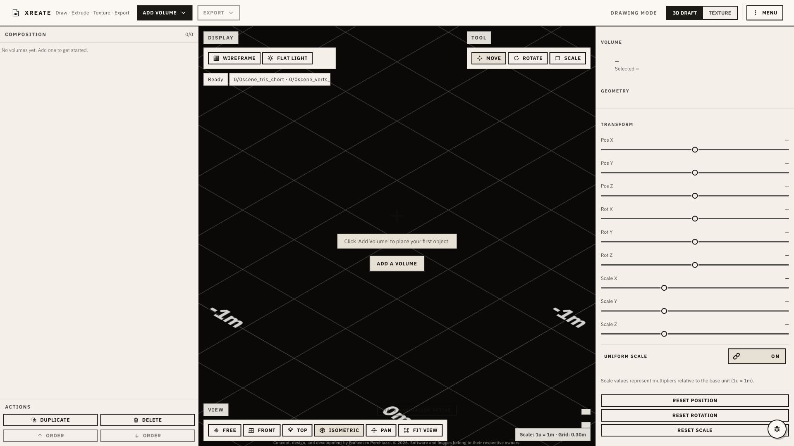

*The initial workspace: add an object, navigate the scene, and inspect the
selected volume in one place.*

### 02 — Primitive catalog

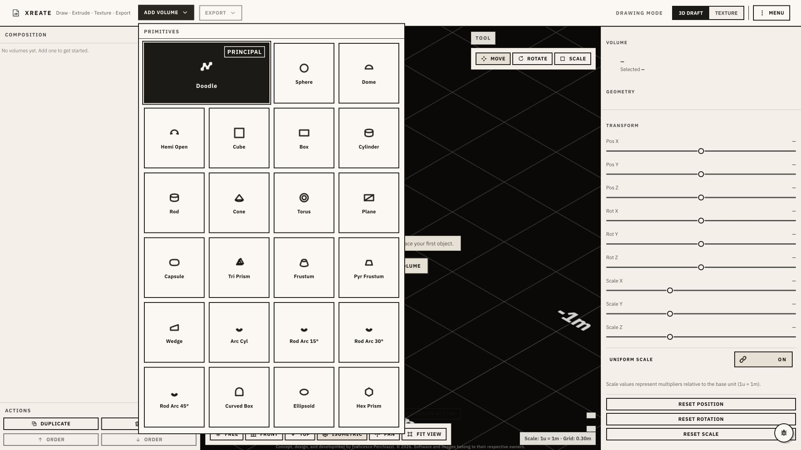

*The primitive catalog contains the core construction volumes and Doodle entry
point.*

### 03 — Geometry inspector

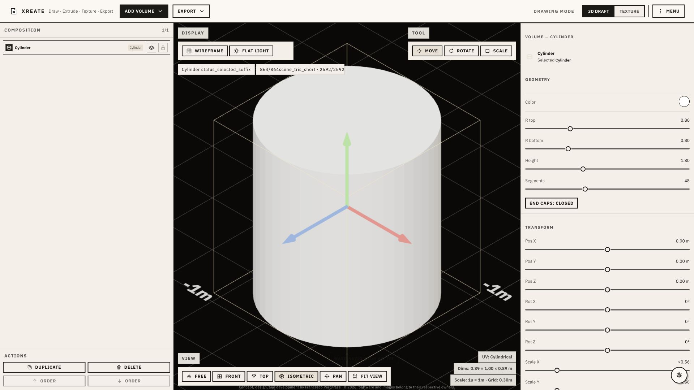

*A selected volume exposes its shape-specific parameters, colour, end caps,
and transforms.*

### 04 — Viewport tools

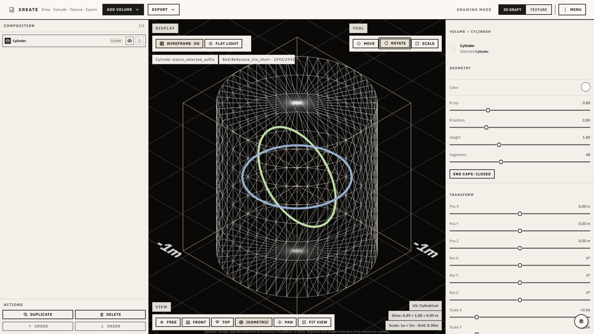

*Use the display, transform, and camera controls to understand and position a
volume in space.*

### 05 — UV mapping

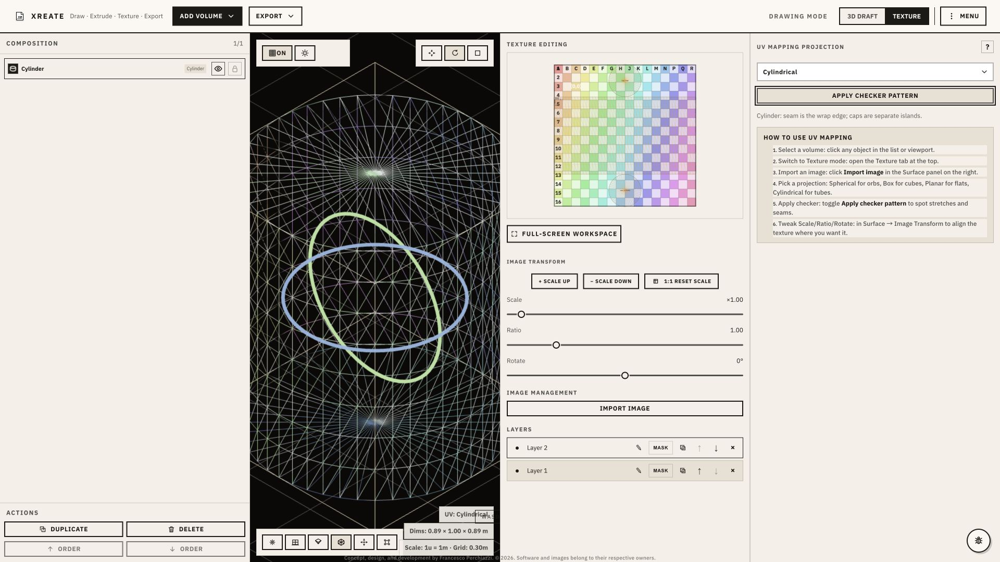

*Texture mode presents the UV overlay alongside the mapping projection and its
checker diagnostic.*

### 06 — Image transform and layers

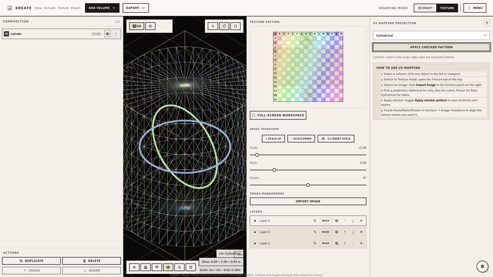

*Scale, ratio, rotation, and layers remain available together while refining a
surface. Open **Full-screen workspace** for a larger, live editing surface:
the selected layer, its clipping mask, and all transform controls remain the
same controls used in the standard panel. Scaling a masked layer keeps its
image and mask together around the mask centre.*

### 07 — Doodle source

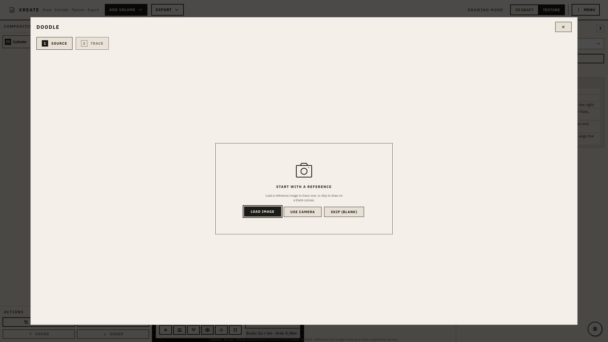

*Doodle starts by choosing a reference image, camera capture, or an empty
canvas.*

### 08 — Doodle polygon

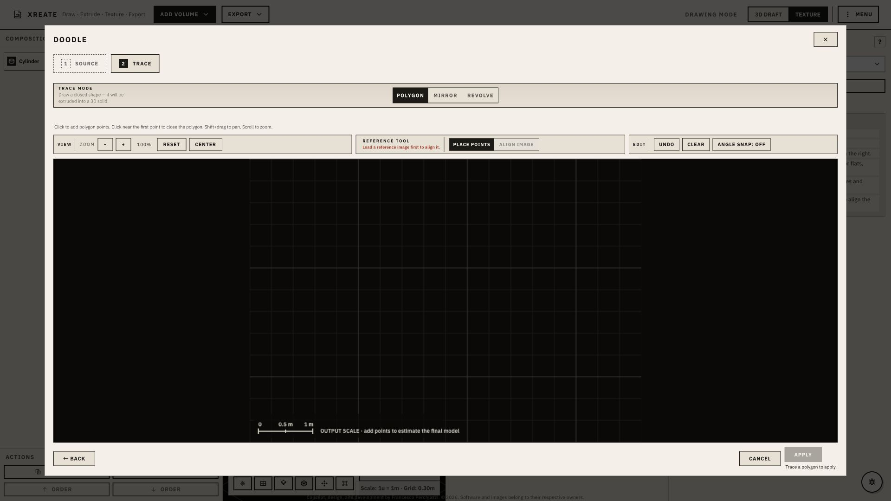

*Polygon traces a closed outline and extrudes it as a solid.*

### 09 — Doodle mirror

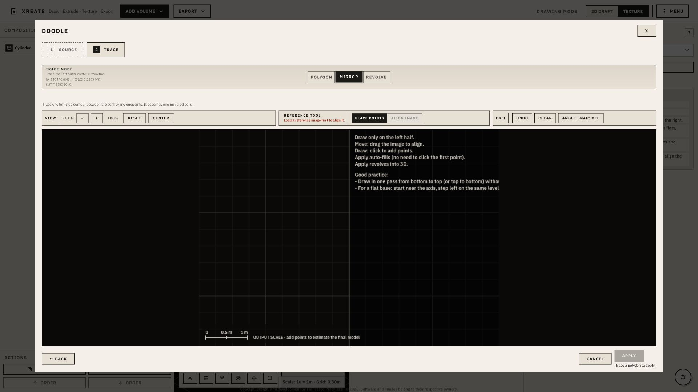

*Mirror turns one half-contour into a single, continuous bilateral volume; the
same editor also provides the Revolve construction mode.*

### 10 — Export formats

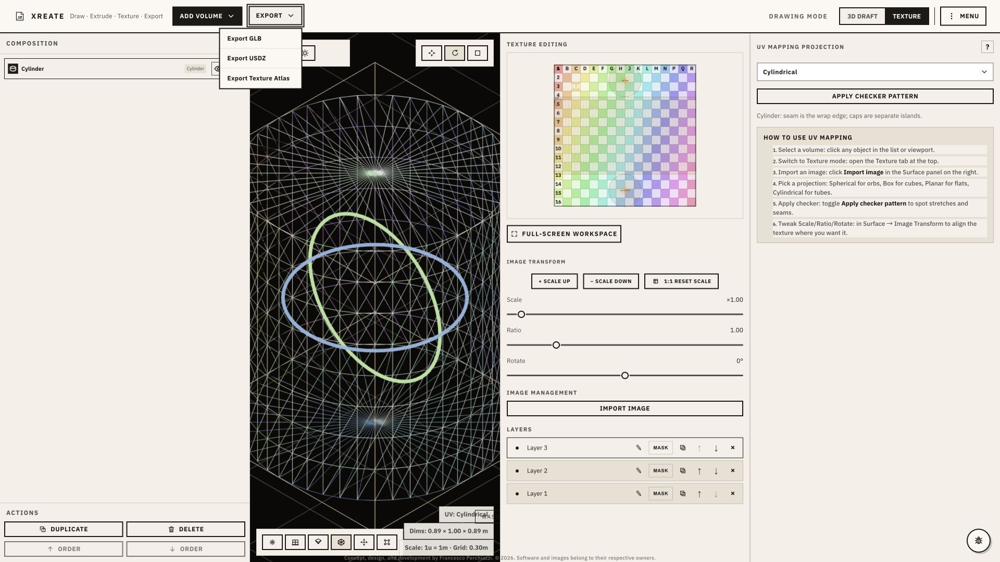

*Export a portable GLB or USDZ model, or save the texture atlas for follow-up
work.*

### 11 — Doodle revolve

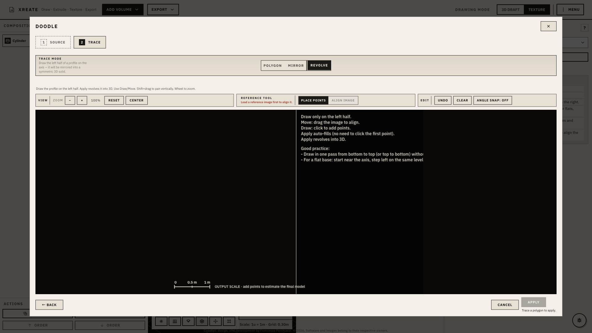

*Revolve traces a profile on one side of the axis and turns it into a complete
rotational solid for forms such as bottles, cans, and planets.*

### 12 — Cylindrical layers and circular clipping mask

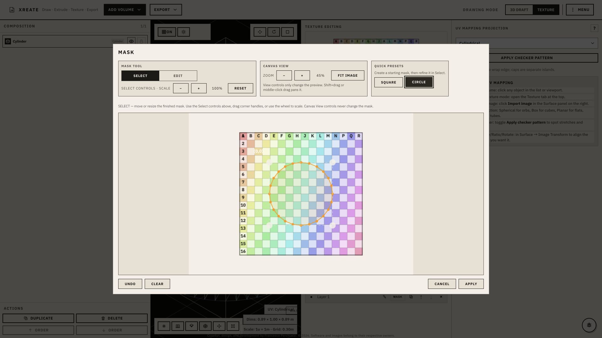

*The first supplied image is applied as the cylinder’s base surface layer. The
second is added above it as a separate layer and refined with the Circle mask
over the cap region of the cylindrical UV layout.*

### 13 — UV workspace

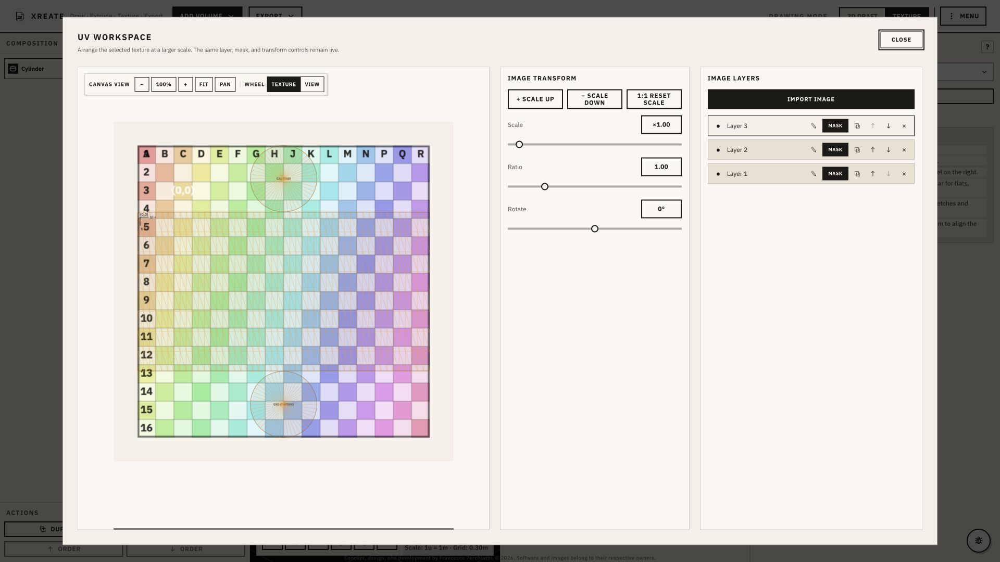

*The full-screen workspace keeps one live UV canvas, selected layer, clipping
mask, and transform controls together. Canvas View provides independent zoom,
Fit, and Pan controls for precise arrangement without changing the image’s
actual transform. The Wheel selector keeps trackpad and mouse-wheel zoom
consistent with the standard panel by defaulting to Texture, while View zooms
only the canvas.*

## Interactive demo clips

Three silent, English-language desktop recordings show real XReate interactions
with an on-screen pointer. They contain only the app viewport: no Finder,
desktop, system menu bar, or personal system data is shown.

| Clip | What it shows |
| --- | --- |
| [01 — Compose volumes](docs/media/xreate-live-01-compose-volumes.mp4) | Add a Cube, Cylinder, and Sphere; then select, scale, position, and frame the simple composition. |
| [02 — Doodle Polygon](docs/media/xreate-live-02-doodle-polygon.mp4) | Open a blank Doodle canvas, place a closed five-point contour, and extrude it into an editable volume. |
| [03 — Texture and UV](docs/media/xreate-live-03-texture-uv.mp4) | Open Texture mode, apply an image, adjust its UV transform, enable the checker diagnostic, and enter the full-screen workspace. |

Each MP4 is 30 seconds, 1920 × 1080, H.264, and has no audio track. The
earlier [one-minute overview](docs/media/xreate-demo-english-16x9.mp4) remains
available as a broader product-tour cut.

## Tutorial — human-authored scene walkthroughs

These current-app captures document every human-authored reference scene in
[`scenes/`](scenes/README.md). They show the composition structure and, where
an image layer is present, its UV canvas and projection controls.

### 14 — Polygon and Mirror Doodle construction

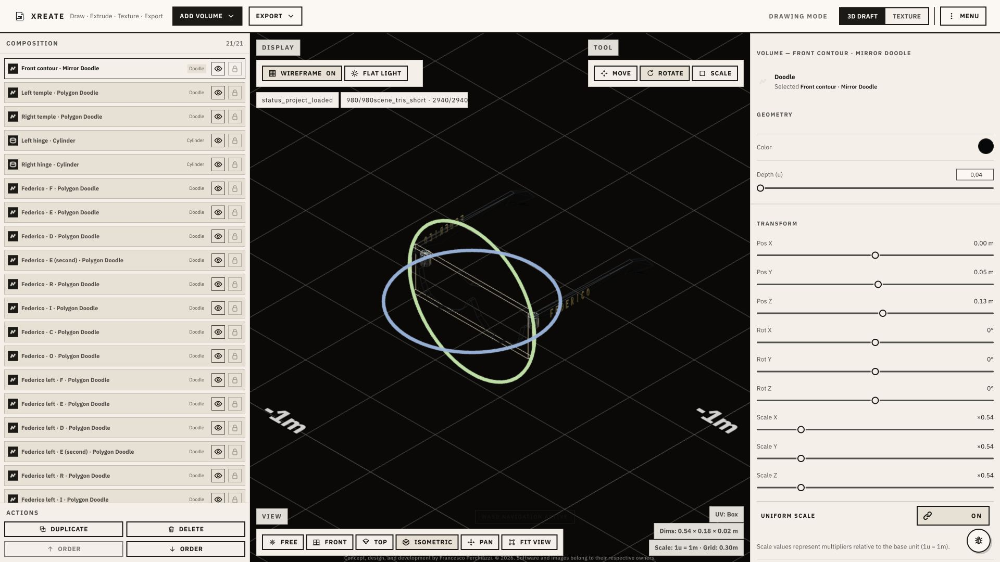

*The glasses exercise exposes its 21 selectable construction volumes: a Mirror
Doodle front contour, Polygon Doodle temples and lettering, and two cylinder
hinges. The selected contour’s depth and transform are visible in the
inspector.*

### 15 — Revolve Doodle with cylindrical UV layout

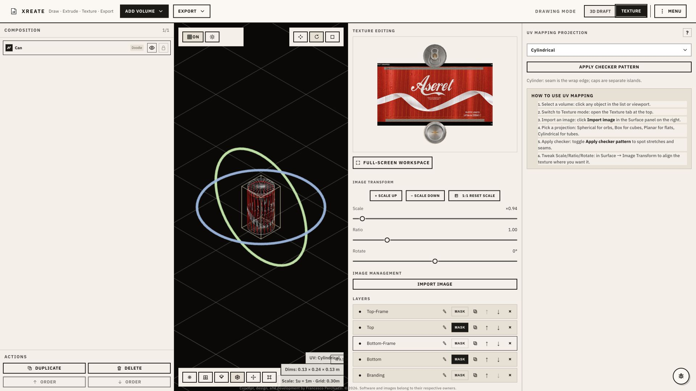

*The Revolve Doodle’s structure remains selected in Composition while the
cylindrical wrap, cap islands, image layers, and projection guidance are
visible together.*

### 16 — Pencil-and-paper Polygon Doodle

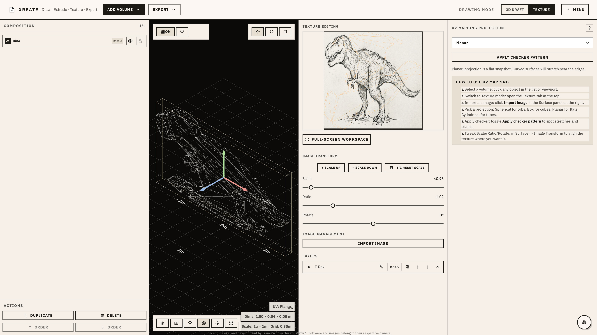

*A developer drawing is kept as the editable source layer and traced into a
single 96-point Polygon Doodle. The planar UV canvas makes the relationship
between drawing, texture layer, and extruded structure explicit.*

### 17 — Sphere volume with spherical UV mapping

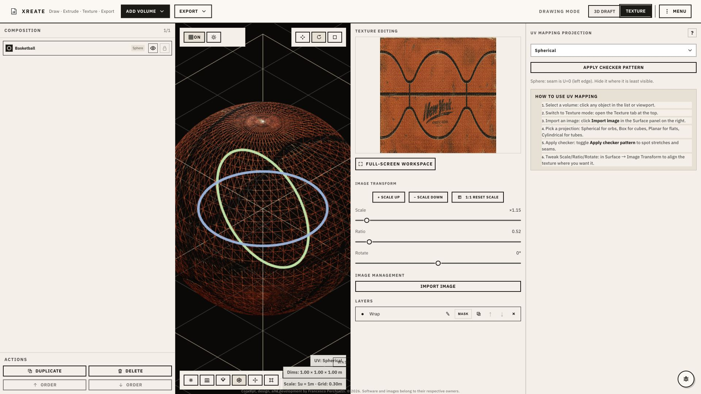

*The one-volume basketball example pairs a visible spherical mesh with its
Spherical UV canvas, wrap layer, transform controls, and seam guidance.*

### 18 — UV Checker structure catalogue

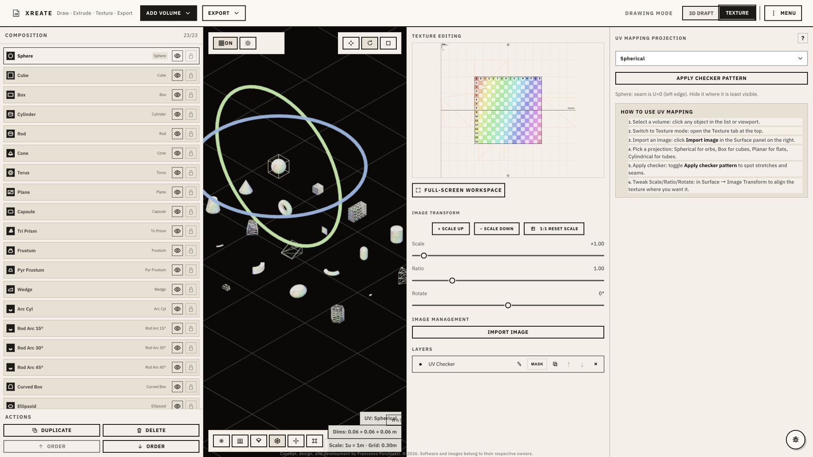

*The checker scene keeps all 23 shape families in the composition panel while
showing the selected shape’s UV canvas and projection selector for comparative
mapping review.*

## Tutorial — create with Doodle Polygon and Mirror

The following reference scene is a compact construction exercise. It uses
simple volumes only: no texture is needed to understand the modelling steps.

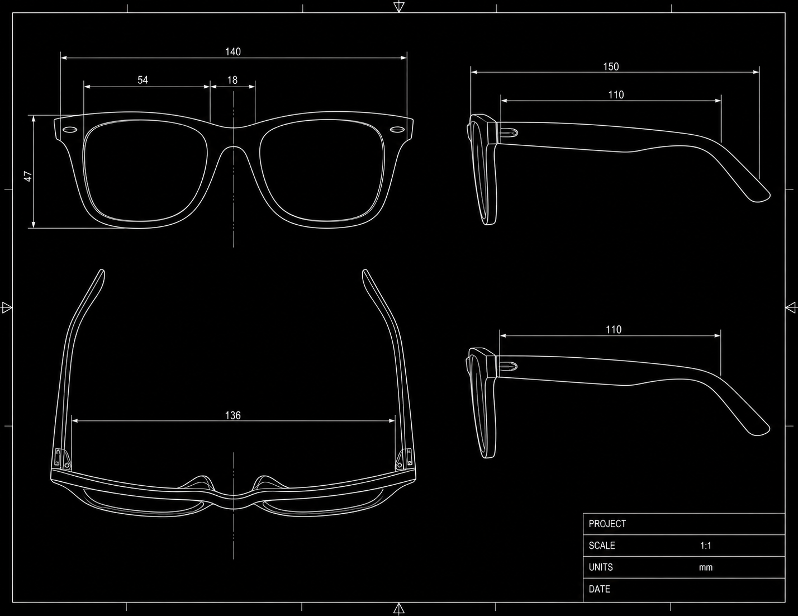

1. Open **Add Volume → Doodle** and choose a blank canvas.
2. In **Mirror**, draw one half of the front contour. Keep the bridge on the
   centre line; XReate creates the opposite half as one continuous solid.
3. In **Polygon**, draw one temple as a closed side silhouette, then duplicate
   it and rotate or mirror the copy for the other side.
4. Add two small cylinder primitives as hinges. Treat the supplied drawing as
   a proportion guide, not as a production specification.
5. Use the inspector to position each part, then save the project before
   exporting. Keep the complete exercise at device scale for AR/XR review.

The finished exercise is
[Create with Doodle Polygon and Mirror](scenes/xreate_example_create-with-doodle-polygon-and-mirror.xreate.json).
It contains a smooth Mirror Doodle front contour, a Polygon Doodle temple
duplicated for the opposite side, two minimal hinges, and raised Polygon
Doodle lettering. The technical drawing above is a documentation-only visual
reference; it is not a texture layer in the scene.

## Reference scene library

Each scene is a portable `.xreate.json` project for inspection, download, or
repeatable testing.

### Authorship and visual inputs

The device-scale projects directly in [`scenes/`](scenes/README.md) are
human-authored. Their supplied image textures are deliberate workflow inputs:
they model a coder working with graphics supplied by others, not a claim that
the scene author also created the graphic assets. See
[`assets/ATTRIBUTION.md`](assets/ATTRIBUTION.md) for credits.

The large-scale studies in
[`scenes/cinematic-experimental/`](scenes/cinematic-experimental/README.md)
are AI-generated, use only solid material colours, and are documented
separately from the device-scale exercises.

| Scene | What it demonstrates |
| --- | --- |
| [Create with Doodle Polygon and Mirror](scenes/xreate_example_create-with-doodle-polygon-and-mirror.xreate.json) | Bilateral Mirror contour, Polygon Doodle temples, duplication, hinges, and small raised details. |
| [Create with Pencil and Paper Doodle Polygon](scenes/xreate_example_create-with-pencil-and-paper-doodle-polygon.xreate.json) | A developer’s pencil-and-paper reference drawing traced as a 96-point Polygon Doodle, with the source image retained as a layer. |
| [Create with Doodle Revolve](scenes/xreate_example_create-with-doodle-revolve.xreate.xreate.json) | A rotational Doodle profile and cylindrical UV workflow. |
| [Create with Volume and a Texture](scenes/xreate_example_create-with-volume-and-a-texture.xreate.json) | A primitive volume with an applied image texture. |
| [UV Checker — All Shapes](scenes/xreate_uv_checker_all_shapes.xreate.json) | Projection and checker review across the available shape families. |

## Cinematic large-scale scenes

[The Aurora Gate — Retro-Futurist Terminal](scenes/cinematic-experimental/xreate_cinematic_the-aurora-gate.xreate.json)
is a texture-free 20 × 20 metre Hollywood soundstage with 607 editable
volumes. It is intentionally separate from the AR/XR device-scale reference
scenes: use it to study composition, rhythm, selection, and performance at a
large spatial scale.

[Nebula Flight Deck — Cockpit Stress Test](scenes/cinematic-experimental/xreate_cinematic_nebula-flight-deck-stress-test.xreate.json)
is a fictional, texture-free 20 × 20 metre cockpit made only from coloured
volumes. **Warning:** it deliberately contains more than 3,000 individually
selectable volumes, so it is a stress test and can be slow to load, select,
transform, or export on lower-powered devices.

[Spatial Study Alcove](scenes/cinematic-experimental/xreate_cinematic_spatial-study-alcove.xreate.json)
is a 19-part, texture-free Spatial Computing study with a workstation, portal,
floating cards, seat, and interaction anchors.

## Scene-local export fixtures

Selected reference scenes keep ready-to-open GLB and USDZ files beside their
editable `.xreate.json` sources in [`scenes/`](scenes/). They provide a final
viewer check without first opening the editor.

| Source scene | GLB | USDZ |
| --- | --- | --- |
| Create with Doodle Polygon and Mirror | [GLB](scenes/xreate_example_create-with-doodle-polygon-and-mirror.glb) | [USDZ](scenes/xreate_example_create-with-doodle-polygon-and-mirror.usdz) |
| Create with Pencil and Paper Doodle Polygon | [GLB](scenes/xreate_example_create-with-pencil-and-paper-doodle-polygon.glb) | [USDZ](scenes/xreate_example_create-with-pencil-and-paper-doodle-polygon.usdz) |
| Create with Doodle Revolve | [GLB](scenes/xreate_example_create-with-doodle-revolve_xreate.glb) | [USDZ](scenes/xreate_example_create-with-doodle-revolve_xreate.usdz) |
| Create with Volume and a Texture | [GLB](scenes/xreate_example_create-with-volume-and-a-texture.glb) | [USDZ](scenes/xreate_example_create-with-volume-and-a-texture.usdz) |
| UV Checker — All Shapes | [GLB](scenes/xreate_uv_checker_all_shapes.glb) | [USDZ](scenes/xreate_uv_checker_all_shapes.usdz) |

Open a **GLB** in a glTF-compatible viewer or a **USDZ** with Apple Quick Look
or Reality Composer Pro, then compare it with its adjacent source scene. Each
material uses one USD Preview Surface, the portable PBR graph expected by
RealityKit importers. Apple beta releases can still vary, so re-import a freshly
exported file when testing a new Reality Composer Pro build.

## Interoperability — modern SDKs, Apple Keynote, and Microsoft PowerPoint

An XReate export is never a dead-end artefact: the same GLB and USDZ files move
directly into production tools without a re-topology or re-mapping step. The
reference scenes below (basketball, sun-glasses, fizzy-drink can, and the
pencil-and-paper T-Rex billboard) are imported verbatim into each third-party
tool to prove round-trip fidelity. Beyond the native 3D SDKs, the same USDZ and
GLB assets drop straight into slideware, so a single XReate composition can
serve as a classroom hand-in, a research poster prop, and a live AR demo —
without any intermediate conversion software.

### 19 — USDZ in Apple Reality Composer Pro

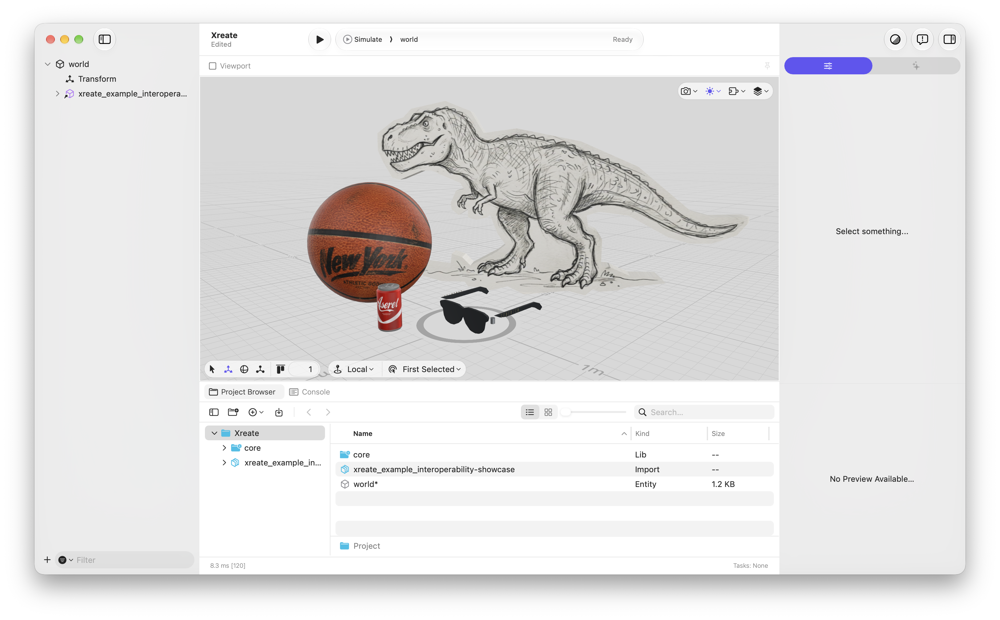

*The full multi-part exercise opens inside Apple Reality Composer Pro straight
from the USDZ export: each volume keeps its individual PBR material, texture
atlas, object hierarchy, and real-world metre scale so it is ready for
RealityKit animation, spatial anchors, and visionOS simulation. Use the same
USDZ file in **Apple Keynote** via **Insert → Choose** or drag-and-drop into a
slide, or drop it directly on a PowerPoint slide in **Microsoft PowerPoint**
(Insert → Pictures → This Device); both Keynote and PowerPoint render the USDZ
as a rotatable 3D object that students can inspect during a lecture.*

### 20 — GLB in Godot

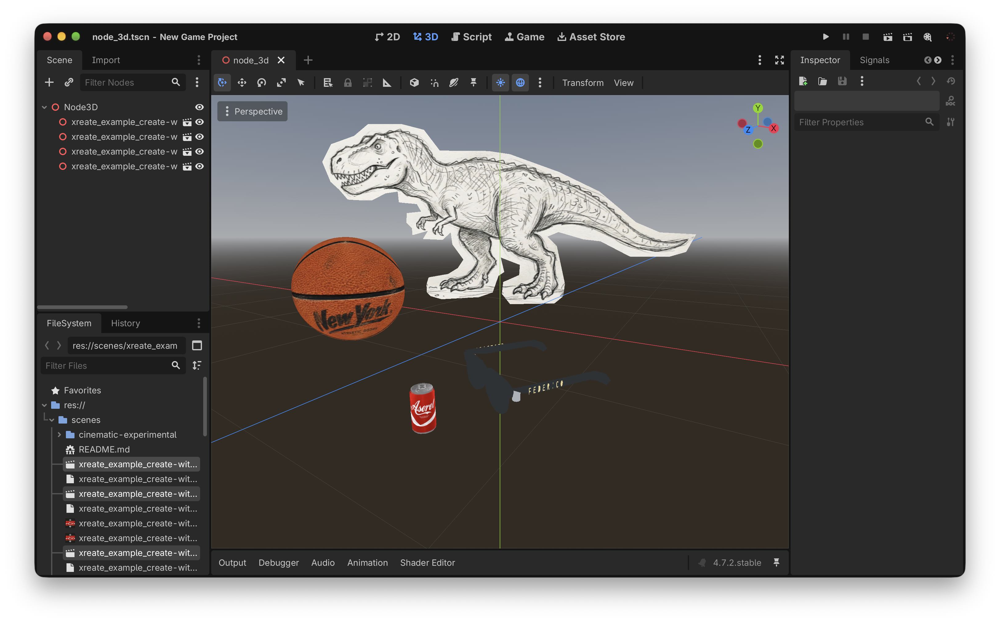

*Godot 4 imports the XReate GLB as a one-click scene: every original part
survives as a named Node3D with its own mesh, material, and UV assignment,
ready for gameplay scripting, physics, and shader overrides. The same GLB is
also compatible with the modern 3D pipelines of Unity, Unreal Engine, Blender,
and Web frameworks such as Three.js, React Three Fiber, and PlayCanvas. In
**Microsoft PowerPoint** use **Insert → 3D Models → From a File** and pick the
GLB; PowerPoint preserves the materials and lets you rotate, pan, and animate
the model on any slide. Apple Keynote currently favours USDZ for 3D slide
insertion, while PowerPoint accepts both USDZ and GLB natively, so the pair of
exports covers all classroom and academic presentation targets from a single
XReate project.*

## Verification

```sh
npm run test:static
npm run test:smoke
npm run test:doodle:stress
```

For a release check, also perform the browser workflow in
[docs/SMOKE-TEST.md](docs/SMOKE-TEST.md). GLB and USDZ should be opened in
independent viewers after export.

Reference scenes are repository assets, intended for GitHub inspection,
download, and **Project → Load** in the app. Each complete reference scene is
kept within one metre on its largest axis for AR/XR device-scale review, verified by
`npm run test:reference-scenes`. The automated Doodle coverage runs with
`npm run test:doodle:stress`; the interactive browser stress harness is in
[`stress-tests-for-the-browser/doodle-stress.js`](stress-tests-for-the-browser/doodle-stress.js).
The separate `scenes/cinematic-experimental/` collection is explicitly large-scale and is
not included in that device-scale check.
## Documentation

- [Notes for Federico](FOR-FEDERICO.md) — the project’s purpose and limits.
- [Architecture](ARCHITECTURE.md) — product data and interaction model.
- [System and UI Atlas](SYSTEM-ATLAS.md) — visible workflows and expected
  outcomes.
- [Repository inventory](docs/REPOSITORY-INVENTORY.md) — purpose and public
  contents of each top-level area.
- [Scene fixtures](scenes/) — editable reference scenes and selected
  scene-local GLB/USDZ checks.
- [Development guide](docs/DEVELOPMENT.md) — running and verifying the app.
- [Known limitations](docs/KNOWN-LIMITATIONS.md) — candid current constraints.
- [Future fixes](docs/FUTURE-FIXES.md) — confirmed maintenance work, planned
  compatibility follow-up, and the boundary between a known issue and a
  future enhancement.
- [Localization](docs/LOCALIZATION.md) — UI language coverage and the
  AI-assisted translation disclaimer.
- [Asset attribution](assets/ATTRIBUTION.md) — licenses and sources for the
  included documentation and UV-test images.
- [Notices](NOTICE.md) — copyright, MIT scope, and third-party material terms.
- [Share XReate](SHARE.md) — a short public introduction for students and
  creative communities.

## Included material

The repository includes example projects, reference assets, automated checks,
and public documentation to help people explore, test, and extend XReate.

See [NOTICE.md](NOTICE.md) for the MIT scope and the terms that apply to
third-party reference assets.
