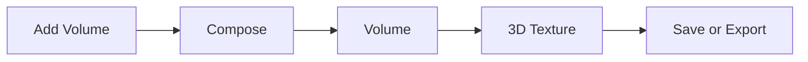
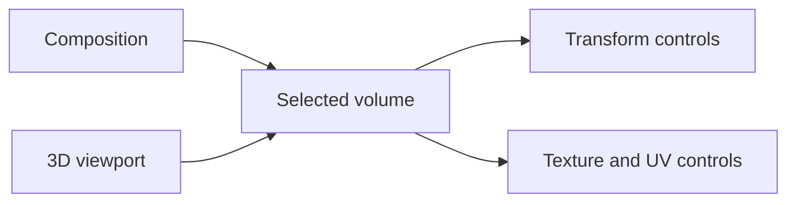
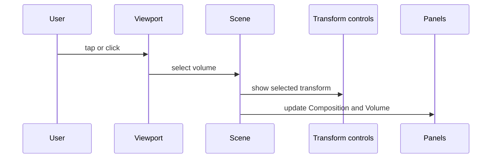
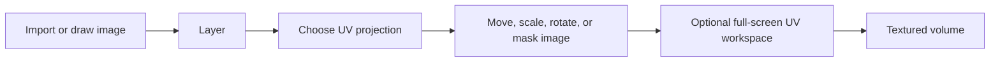
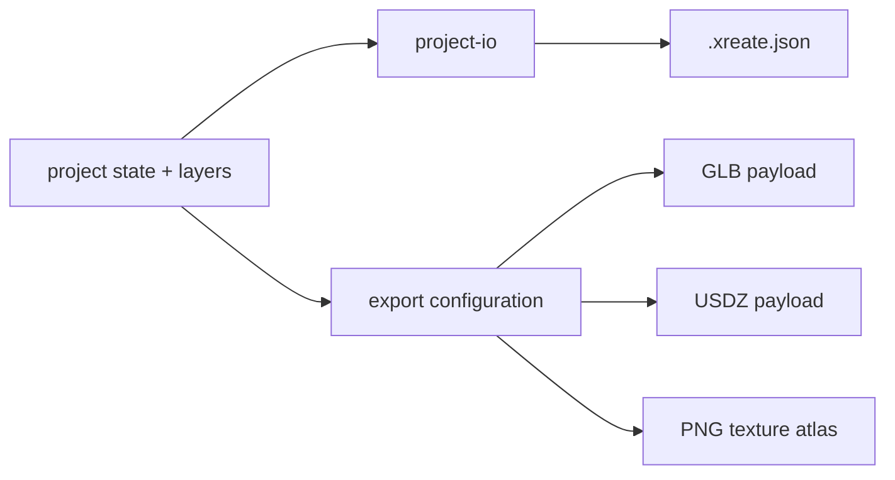
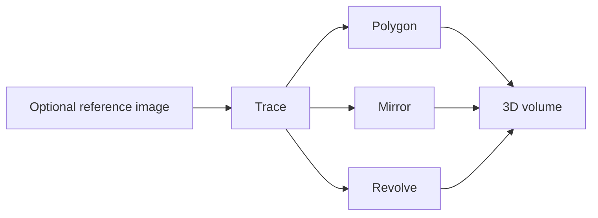

# XReate system and UI atlas

This atlas maps visible controls to the result a person should expect from
them. It is a practical reference for learning, testing, and reporting an
unexpected result.

## Application flow

### Recorded workflow examples

The silent, English-language recordings in the README document the visible
workflow as it runs in the app. They show an on-screen pointer but no desktop,
Finder, menu-bar, or personal system information.

| Workflow | Recording |
| --- | --- |
| Compose primitives | [30-second MP4](docs/media/xreate-live-01-compose-volumes.mp4) |
| Doodle Polygon to volume | [30-second MP4](docs/media/xreate-live-02-doodle-polygon.mp4) |
| Image texture and UV workspace | [30-second MP4](docs/media/xreate-live-03-texture-uv.mp4) |

## Project, selection, and renderer

### Canvas selection

A row clicked in Composition and a volume selected in the viewport always
select the same object. Clicking empty space deselects it.

## Texture and UV pipeline

The texture image, its transform, and its mask belong to the selected volume.
Duplicating a volume creates independent editable surface data for the copy.
When a layer has a clipping mask, scale changes move the image and its linked
mask as one unit around the mask’s centre.

### Full-screen UV workspace

**Full-screen workspace** opens the same live UV canvas, selected layer,
mask, and image-transform controls at a larger scale. It is not a second copy
of the texture editor: changing the layer, its transform, or its mask updates
the selected volume immediately and is reflected in the standard Surface
panel when the workspace closes.

The Canvas View toolbar controls only the view of the UV canvas:

- **+ / −** zoom the displayed canvas without changing the image transform.
- **Fit** resets the canvas view to its neutral framing.
- **Pan** enables direct dragging of the canvas; the mouse wheel also zooms
  the currently selected target while the workspace is open.
- **Wheel: Texture / View** selects what the mouse wheel or trackpad changes.
  **Texture** is the default and matches the standard Surface panel; **View**
  zooms only the displayed UV canvas.

## Persistence and export

GLB and USDZ use different format conventions but originate from the same
scene frame. The test fixture covers root and parented asymmetric transforms;
real browser exports should still be opened in independent viewers.

Selected repository reference scenes have ready-to-open GLB/USDZ files beside
their `.xreate.json` source in [`scenes/`](scenes/). These scene-local fixtures
are for final-viewer testing; the matching source scene remains the editable
source of record.

## Repository reference assets

Reference `.xreate.json` scenes are repository assets. Users can inspect or
download them directly and load a chosen file through Project → Load. Where
present, their paired GLB/USDZ fixtures are stored beside the source scene.

## Visible UI controls

| Area | Control | Expected result |
|---|---|---|
| Header | **Add Volume** | Opens primitive and Doodle choices |
| Header | **Export** | Downloads GLB, USDZ, or texture-atlas files |
| Header | **3D Draft / Texture** | Switches between modelling and surface work |
| Header | **Menu** | Opens project, preferences, help, and About |
| Global | Bug report | Opens a pre-addressed feedback email |
| Composition | Object row | Selects the same volume shown in the viewport |
| Composition | Eye, lock, duplicate, delete | Changes visibility, editability, copy, or removal |
| Viewport | Object tap or click | Selects a volume |
| Viewport | Move, rotate, scale | Changes the selected volume transform |
| Volume | Geometry controls | Changes the selected primitive |
| 3D Texture | Import, layers, image transform | Composes the selected surface |
| 3D Texture | Layer pencil | Opens the selected layer’s rename dialog |
| 3D Texture | UV projection and checker | Changes the selected geometry’s UV layout |
| UV workspace | Canvas View: zoom, Fit, Pan | Navigates the UV preview without changing the texture itself |
| UV workspace | Image transform and layers | Edits the selected layer and its mask using the live editor controls |
| Doodle | Polygon, Mirror, Revolve | Creates the chosen type of traced volume |
| Mask | Select, edit, presets | Creates and refines an image mask |

## Language and About copy

Every visible interface string resolves in the selected language or through an
English fallback. AI-assisted translation drafts are disclosed in the About
panel and in [`docs/LOCALIZATION.md`](docs/LOCALIZATION.md).

## Doodle creation pipeline

| Mode | Input | Result |
|---|---|---|
| Polygon | Closed outline | Extruded solid |
| Mirror | Left-side contour | One bilateral solid |
| Revolve | Vertical profile | 360-degree lathed solid |

The reference image is a movable visual guide. It does not participate in the
geometry and cannot create points. Doodle requires a tablet or desktop canvas;
on phone-sized layouts the Add Volume menu explains this requirement.

An imported texture remains available through Undo and Redo. Closed Doodles
retain an outward-facing surface in compatible GLB and USDZ viewers.

## Responsive behavior

At 768–1159px the viewport is first, with Composition and Volume in the next
row and 3D Texture below; the page scrolls normally. Below 768px the layout is
not a system of floating sheets: it is a vertical document-flow sequence of a
square viewport followed by three accordions, **Composition**, **Volume**, and
**3D Texture**. Volume owns every geometry and transform field; 3D Texture
owns Texture Editing and the live UV Mapping controls. A compatibility guard
removes old sheet state on phones, preventing one panel from overlaying the
next.

On touch devices, range controls retain usable targets (40px on tablet,
compact 34px/22px thumb on phones). In the UV canvas, two-finger distance
zooms while its midpoint pans the image. In the viewport, a two-finger drag
pans the camera; a one-finger drag orbits.

Dialogs are constrained to the available viewport width, including safe-area
padding. The Rename Layer dialog keeps its text field and confirmation actions
inside that width; only exceptionally narrow screens stack its two actions.

## Debugging a report

1. Record one user gesture and the expected visible outcome.
2. Open browser console and export `XR.DebugLog.toJSON()` after the gesture.
3. Follow the matching path above until the first observed divergence.
4. Reproduce it with a small fixture before editing code.

See [docs/DEVELOPMENT.md](docs/DEVELOPMENT.md) for the recorder and test
commands.
